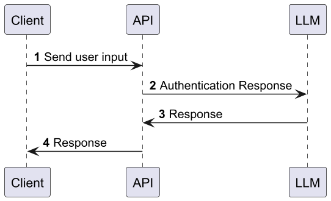

# AI Service API using Spring AI

A minimal Spring Boot (WebFlux) sample that integrates a Large Language Model (LLM) via Spring AI. It demonstrates:
- Direct responses from an AI model
- Token-by-token streaming responses
- Structured outputs mapped to a custom model

## Tech Stack

- Java 21
- Spring Boot 3.x (WebFlux)
- Spring AI (ChatClient + model provider)
- Reactor (Flux, Mono)
- OpenAPI/Swagger (optional)
- SLF4J logging

## Quick Start

Prerequisites:
- Java 21 installed and on PATH
- Maven
- An AI provider key (use a placeholder in local configs)


1) Configure your AI provider credentials (examples below use placeholders):
- Environment variables:
```shell script
export OPENAI_API_KEY=<your-openai-api-key>
 ```

- Or application.yml:
```yaml
spring:
    ai:
      openai:
        api-key: ${OPENAI_API_KEY}
```


2) Run the service:
- Maven:
```shell script
mvn spring-boot:run
```

- Gradle:
```shell script
./gradlew bootRun
```


Service starts by default on http://localhost:8080.

## Architecture Overview

- Controller layer (path: /ai)
  - Exposes endpoints for direct, streaming, and structured responses.
- Service layer
  - Orchestrates Spring AI’s ChatClient and the underlying model.
  - Provides methods to get plain text, streaming chunks, and structured results.
- Model layer
  - Defines data structures for strongly-typed, structured outputs.

This separation keeps HTTP concerns out of the AI orchestration and makes it easy to swap or configure models.

## API Endpoints

Base path: /ai

1) GET /ai/generate
- Purpose: Returns a simple JSON map with the AI’s response.
- Query:
  - userInput (optional; default: "Say Hello to me")
- Example:
```shell script
curl -G "http://localhost:8080/ai/generate" \
    --data-urlencode "userInput=Tell me a fun fact about cats"
```

- Sample response:
```json
{
    "message": "Cats have flexible spines that help them land on their feet."
  }
```


2) GET /ai/generate/stream
- Purpose: Streams the AI response reactively as text chunks.
- Query:
  - userInput (optional; default: "Say Hello to me")
- Notes:
  - Use a streaming-capable client.
  - For Server-Sent Events (SSE), set Accept: text/event-stream if your client prefers it.
- Examples:
```shell script
# Chunked transfer
  curl -N -G "http://localhost:8080/ai/generate/stream" \
    --data-urlencode "userInput=Stream a short motivational quote"
```


3) GET /ai/generate/stream/mono
- Purpose: Emits a single string via Mono for uniform reactive handling.
- Query:
  - userInput (optional; default: "Say Hello to me")
- Example:
```shell script
curl -G "http://localhost:8080/ai/generate/stream/mono" \
    --data-urlencode "userInput=Give me a one-liner"
```


4) GET /ai/generate/structured
- Purpose: Returns a strongly-typed, structured model built from the AI response (e.g., pairs of name/value).
- Query:
  - userInput (optional; default: "name 10 countries with their capital cities")
- Example:
```shell script
curl -G "http://localhost:8080/ai/generate/structured" \
    --data-urlencode "userInput=get me continents with their list of countries"
```

- Sample response:
```json
{
  "responseModel": [
    {
      "key": "Africa",
      "values": [
        "Algeria",
        "Angola",
        "Benin",
        "Botswana",
        "Burkina Faso",
        "Burundi",
        "Cabo Verde",
        "Cameroon",
        "Central African Republic",
        "Chad",
        "Comoros",
        "Congo, Republic of the",
        "Congo, Democratic Republic of the",
        "Djibouti",
        "Egypt",
        "Equatorial Guinea",
        "Eritrea",
        "Eswatini",
        "Ethiopia",
        "Gabon",
        "Gambia",
        "Ghana",
        "Guinea",
        "Guinea-Bissau",
        "Ivory Coast",
        "Kenya",
        "Lesotho",
        "Liberia",
        "Libya",
        "Madagascar",
        "Malawi",
        "Mali",
        "Mauritania",
        "Mauritius",
        "Morocco",
        "Mozambique",
        "Namibia",
        "Niger",
        "Nigeria",
        "Rwanda",
        "Sao Tome and Principe",
        "Senegal",
        "Seychelles",
        "Sierra Leone",
        "Somalia",
        "South Africa",
        "South Sudan",
        "Sudan",
        "Tanzania",
        "Togo",
        "Uganda",
        "Zambia",
        "Zimbabwe"
      ]
    },
    {
      "key": "Asia",
      "values": [
        "Afghanistan",
        "Armenia",
        "Azerbaijan",
        "Bahrain",
        "Bangladesh",
        "Bhutan",
        "Brunei",
        "Cambodia",
        "China",
        "Cyprus",
        "Georgia",
        "India",
        "Indonesia",
        "Iran",
        "Iraq",
        "Israel",
        "Japan",
        "Jordan",
        "Kazakhstan",
        "Kuwait",
        "Kyrgyzstan",
        "Laos",
        "Lebanon",
        "Malaysia",
        "Maldives",
        "Mongolia",
        "Myanmar",
        "Nepal",
        "North Korea",
        "Oman",
        "Pakistan",
        "Palestine",
        "Philippines",
        "Qatar",
        "Saudi Arabia",
        "Singapore",
        "South Korea",
        "Sri Lanka",
        "Syria",
        "Tajikistan",
        "Thailand",
        "Timor-Leste",
        "Turkmenistan",
        "United Arab Emirates",
        "Uzbekistan",
        "Vietnam",
        "Yemen"
      ]
    },
    {
      "key": "Europe",
      "values": [
        "Albania",
        "Andorra",
        "Armenia",
        "Austria",
        "Azerbaijan",
        "Belarus",
        "Belgium",
        "Bosnia and Herzegovina",
        "Bulgaria",
        "Croatia",
        "Cyprus",
        "Czech Republic",
        "Denmark",
        "Estonia",
        "Finland",
        "France",
        "Georgia",
        "Germany",
        "Greece",
        "Hungary",
        "Iceland",
        "Ireland",
        "Italy",
        "Kazakhstan",
        "Kosovo",
        "Latvia",
        "Lithuania",
        "Luxembourg",
        "Malta",
        "Moldova",
        "Monaco",
        "Montenegro",
        "Netherlands",
        "North Macedonia",
        "Norway",
        "Poland",
        "Portugal",
        "Romania",
        "Russia",
        "San Marino",
        "Serbia",
        "Slovakia",
        "Slovenia",
        "Spain",
        "Sweden",
        "Switzerland",
        "Turkey",
        "Ukraine",
        "United Kingdom",
        "Vatican City"
      ]
    },
    {
      "key": "North America",
      "values": [
        "Antigua and Barbuda",
        "Bahamas",
        "Barbados",
        "Belize",
        "Canada",
        "Costa Rica",
        "Cuba",
        "Dominica",
        "Dominican Republic",
        "El Salvador",
        "Grenada",
        "Guatemala",
        "Haiti",
        "Honduras",
        "Jamaica",
        "Mexico",
        "Nicaragua",
        "Panama",
        "Saint Kitts and Nevis",
        "Saint Lucia",
        "Saint Vincent and the Grenadines",
        "United States"
      ]
    },
    {
      "key": "Oceania",
      "values": [
        "Australia",
        "Fiji",
        "Kiribati",
        "Marshall Islands",
        "Micronesia",
        "Nauru",
        "New Zealand",
        "Palau",
        "Papua New Guinea",
        "Samoa",
        "Solomon Islands",
        "Tonga",
        "Tuvalu",
        "Vanuatu"
      ]
    },
    {
      "key": "South America",
      "values": [
        "Argentina",
        "Bolivia",
        "Brazil",
        "Chile",
        "Colombia",
        "Ecuador",
        "Guyana",
        "Paraguay",
        "Peru",
        "Suriname",
        "Uruguay",
        "Venezuela"
      ]
    }
  ]
}
```


## Using the API Programmatically

- Java WebClient usage:
```java
import org.springframework.web.reactive.function.client.WebClient;
  import reactor.core.publisher.Flux;
  import reactor.core.publisher.Mono;

  public class AiClient {
      private final WebClient webClient = WebClient.create("http://localhost:8080");

      public Mono<String> generate(String userInput) {
          return webClient.get()
              .uri(uriBuilder -> uriBuilder.path("/ai/generate")
                  .queryParam("userInput", userInput)
                  .build())
              .retrieve()
              .bodyToMono(String.class);
      }

      public Flux<String> stream(String userInput) {
          return webClient.get()
              .uri(uriBuilder -> uriBuilder.path("/ai/generate/stream")
                  .queryParam("userInput", userInput)
                  .build())
              .retrieve()
              .bodyToFlux(String.class);
      }

      public Mono<String> streamMono(String userInput) {
          return webClient.get()
              .uri(uriBuilder -> uriBuilder.path("/ai/generate/stream/mono")
                  .queryParam("userInput", userInput)
                  .build())
              .retrieve()
              .bodyToMono(String.class);
      }

      public Mono<String> structured(String userInput) {
          return webClient.get()
              .uri(uriBuilder -> uriBuilder.path("/ai/generate/structured")
                  .queryParam("userInput", userInput)
                  .build())
              .retrieve()
              .bodyToMono(String.class);
      }
  }
```


## Configuration Tips

- Select the model and provider via Spring AI properties or beans.
- For local development:
  - Keep secrets out of source control. Use environment variables or a secure vault.
  - Limit prompt size or introduce validation to prevent abuse.
- Recommended properties (application.yml):
```yaml
spring:
    ai:
      openai:
        api-key: ${OPENAI_API_KEY}
        base-url: ${OPENAI_BASE_URL:}
logging:
    level:
      root: INFO
      your.package: DEBUG
```


## Observability

- Logs capture the incoming query text for traceability. Adjust log levels as needed.
- If OpenAPI is enabled, typical endpoints are:
  - Swagger UI: http://localhost:8080/swagger-ui/index.html
  - OpenAPI JSON: http://localhost:8080/v3/api-docs

## Testing

- Unit tests: mock the AI client to avoid network calls.
- WebFlux tests: use WebTestClient to assert synchronous and streaming behaviors.
- Contract tests: verify the structured endpoint returns the expected schema.

## Production Considerations

- Add authentication/authorization if exposed publicly.
- Consider rate limiting and request validation (e.g., max length for userInput).
- Timeouts and retries for upstream AI calls.
- Backpressure-friendly streaming clients.
- Observability: metrics, tracing, and correlation IDs.

## Troubleshooting

- 401/403 from AI provider: check API key env vars.
- Slow responses: verify model choice, prompt size, and network.
- Streaming stalls: ensure client keeps the connection open and doesn’t buffer the entire response.

